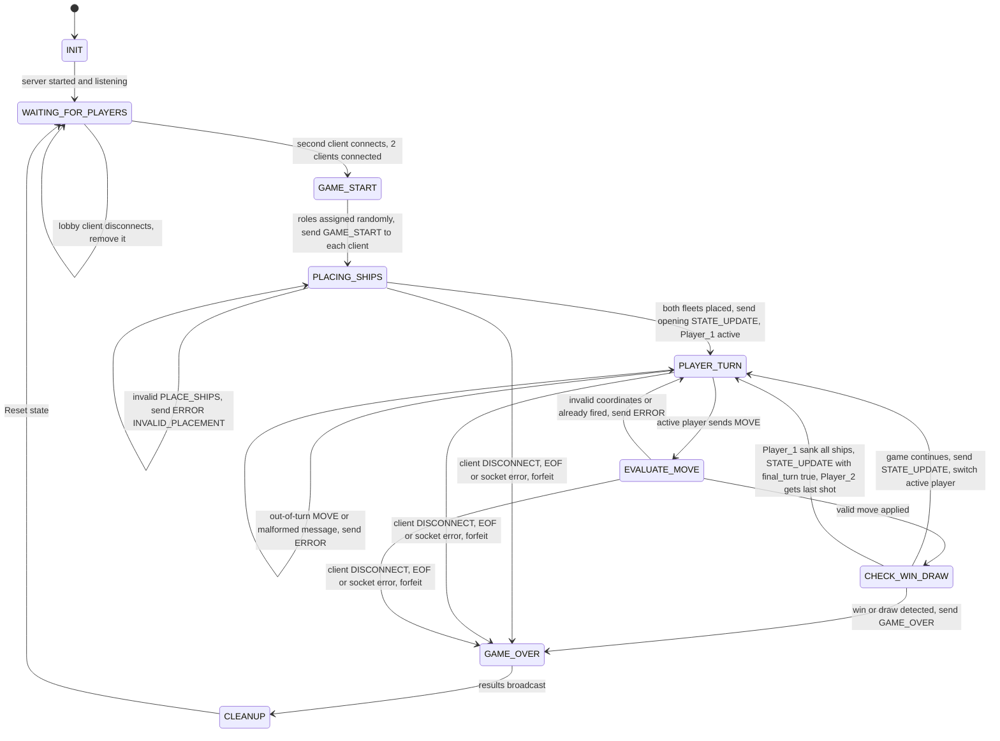

```mermaid
stateDiagram-v2
    [*] --> INIT
    INIT --> WAITING_FOR_PLAYERS: server started and listening
    WAITING_FOR_PLAYERS --> WAITING_FOR_PLAYERS: first client connects, send to LOBBY_WAIT
    WAITING_FOR_PLAYERS --> WAITING_FOR_PLAYERS: lobby client disconnects, remove it
    WAITING_FOR_PLAYERS --> GAME_START: second client connects, 2 clients connected
    GAME_START --> PLACING_SHIPS: roles assigned randomly, send GAME_START to each client
    PLACING_SHIPS --> PLACING_SHIPS: valid PLACE_SHIPS, send VERIFY_PLACEMENT
    PLACING_SHIPS --> PLACING_SHIPS: invalid PLACE_SHIPS, send ERROR INVALID_PLACEMENT
    PLACING_SHIPS --> PLAYER_TURN: both fleets placed, send opening STATE_UPDATE, Player_1 active
    PLAYER_TURN --> PLAYER_TURN: out-of-turn MOVE or malformed message, send ERROR
    PLAYER_TURN --> EVALUATE_MOVE: active player sends MOVE
    EVALUATE_MOVE --> PLAYER_TURN: invalid coordinates or already fired, send ERROR
    EVALUATE_MOVE --> CHECK_WIN_DRAW: valid move applied
    CHECK_WIN_DRAW --> PLAYER_TURN: game continues, send STATE_UPDATE, switch active player
    CHECK_WIN_DRAW --> PLAYER_TURN: Player_1 sank all ships, STATE_UPDATE with final_turn true, Player_2 gets last shot
    CHECK_WIN_DRAW --> GAME_OVER: win or draw detected, send GAME_OVER
    PLACING_SHIPS --> GAME_OVER: client DISCONNECT, EOF or socket error, forfeit
    PLAYER_TURN --> GAME_OVER: client DISCONNECT, EOF or socket error, forfeit
    EVALUATE_MOVE --> GAME_OVER: client DISCONNECT, EOF or socket error, forfeit
    GAME_OVER --> CLEANUP: results broadcast
    CLEANUP --> WAITING_FOR_PLAYERS: Reset state
```
